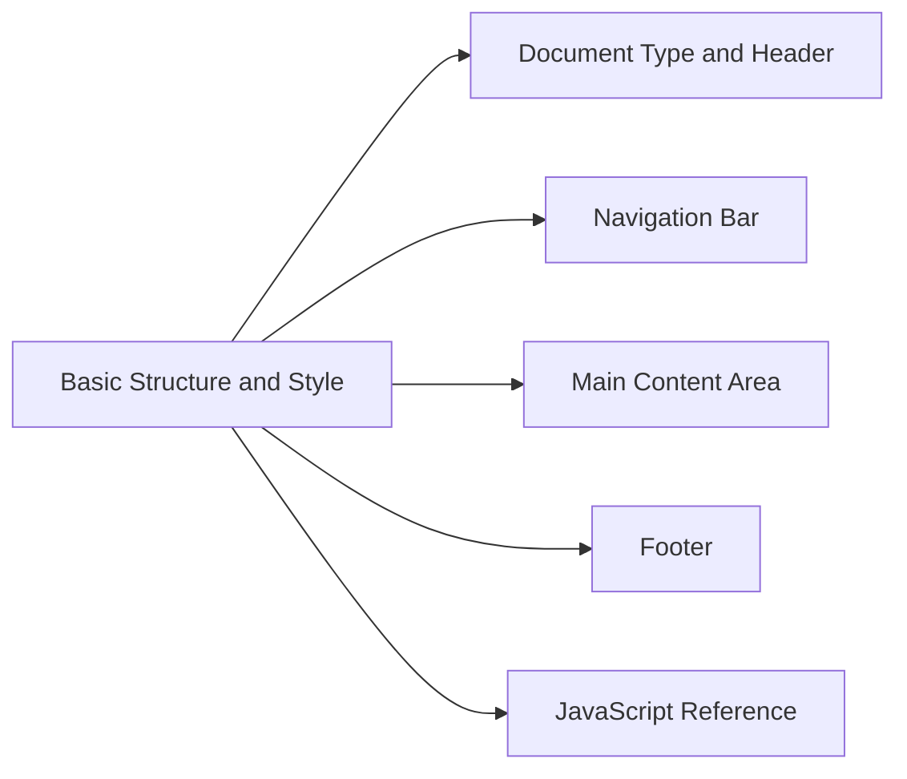
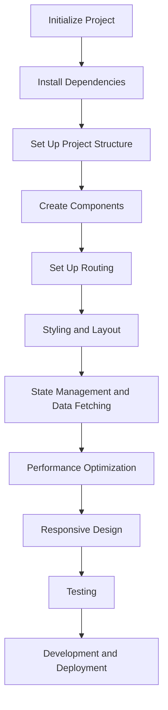
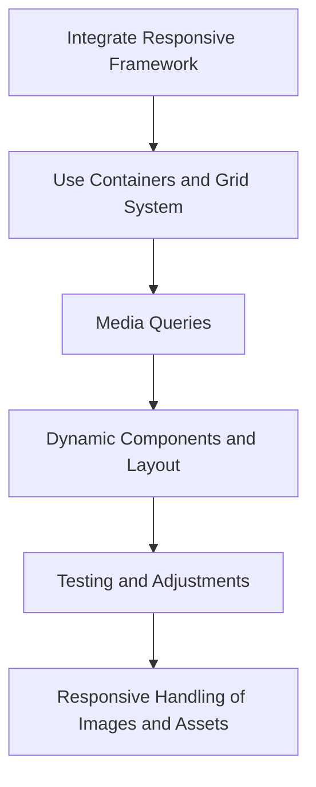
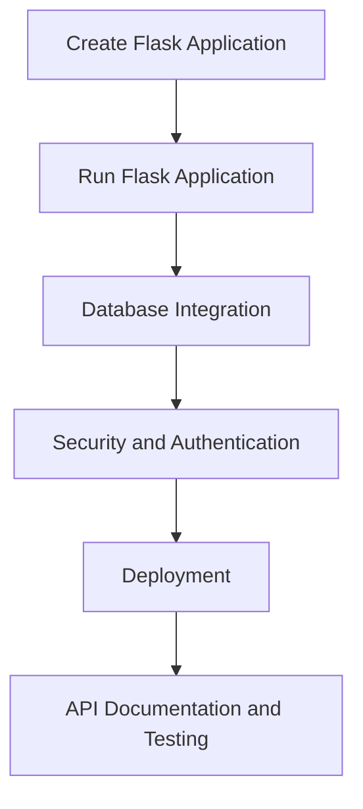
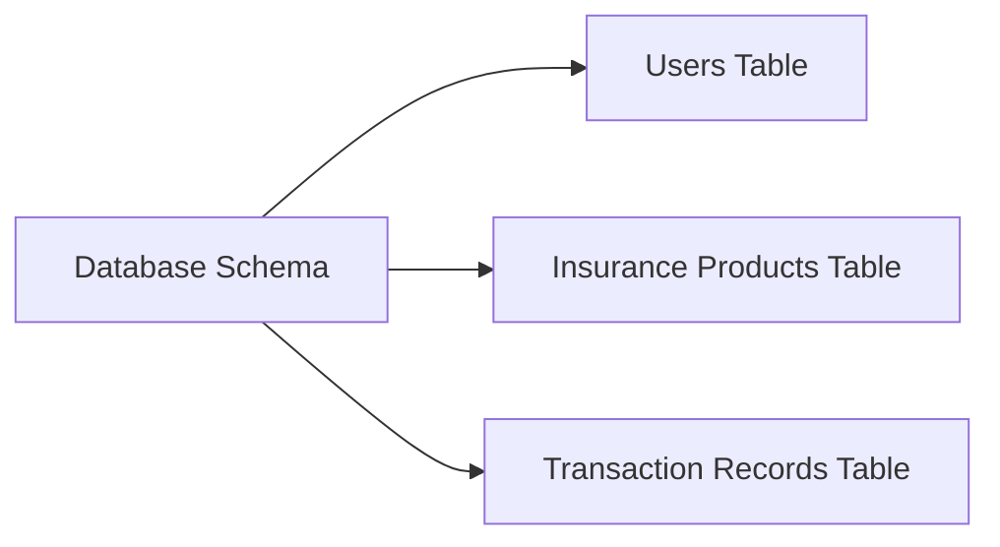
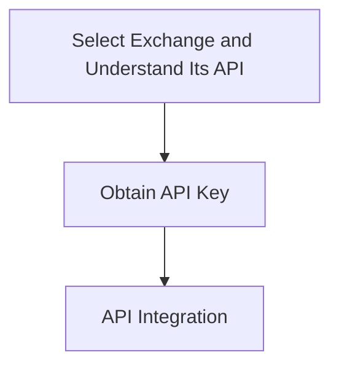
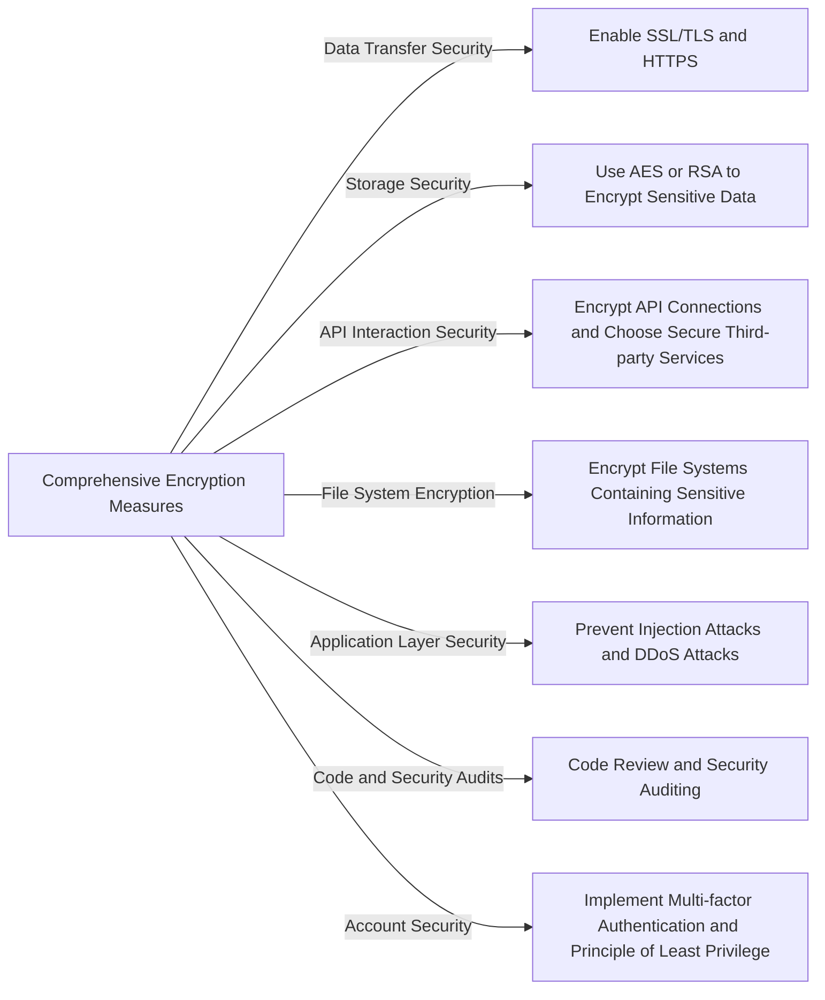
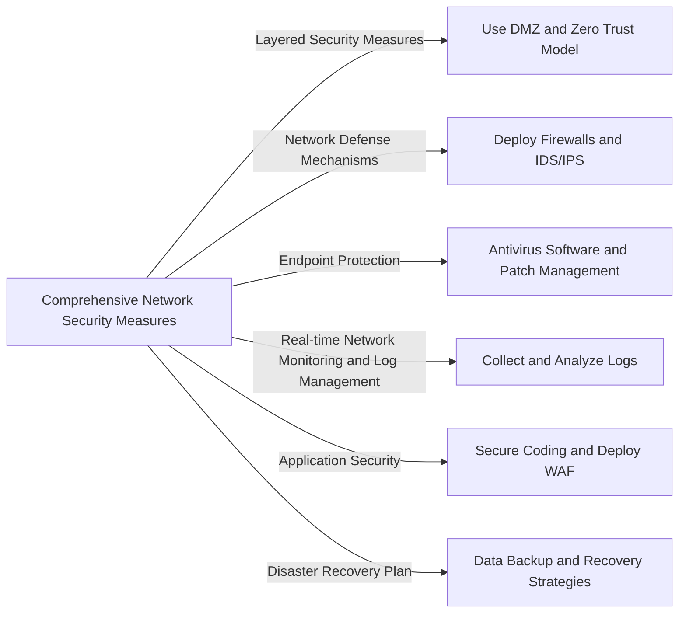
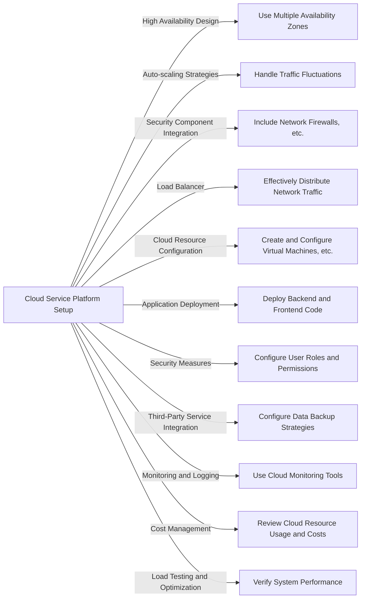

# BTI Architecture


Figure 4.1.1 - BTI Platform Architecture


## 1. BTI Platform Frontend Development

### 1.1. HTML for Building the Basic Structure and Style of the Website



Figure 4.1.2 - HTML for Building the Basic Structure and Style of the Website

**1.1.1. Document Type and Head**

```html
<!DOCTYPE html>
<html>
<head>
    <title>Virtual Currency Contract Trading Insurance</title>
    <link rel="stylesheet" href="<https://stackpath.bootstrapcdn.com/bootstrap/4.3.1/css/bootstrap.min.css>">
    <style>
        .navbar-custom { background-color: #004d99; }
        .navbar-custom .navbar-brand,
        .navbar-custom .nav-link { color: white; }
    </style>
</head>
```

This part defines the document type, the title of the webpage, includes the Bootstrap CSS framework, and adds some custom styles.

**1.1.2. Navigation Bar**

```html
<body>
    <nav class="navbar navbar-expand-lg navbar-custom">
        <a class="navbar-brand" href="#">Virtual Currency Trading Insurance</a>
        <div class="collapse navbar-collapse">
            <ul class="navbar-nav mr-auto">
                <li class="nav-item"><a class="nav-link" href="#">Main Page</a></li>
                <li class="nav-item"><a class="nav-link" href="#">Insurance Products</a></li>
                <li class="nav-item"><a class="nav-link" href="#">Trading Platform</a></li>
                <li class="nav-item"><a class="nav-link" href="#">Contact Us</a></li>
            </ul>
        </div>
    </nav>
```

Here, we use Bootstrap's navbar component. It includes a brand logo and several navigation links.

**1.1.3. Main Content Area**

```html
<div class="container">
        <h1>Welcome to Virtual Currency Contract Trading Insurance</h1>
        <!-- Content area can be added as per actual page requirements -->
    </div>
```

This is the main body part of the page for displaying the primary content. Currently, there's only a heading, but more content can be added as needed.

**1.1.4. Footer**

```html
<footer class="text-center text-lg-start bg-light text-muted">
        <section class="d-flex justify-content-center justify-content-lg-between p-4 border-bottom">
            <div class="me-5 d-none d-lg-block">
                <span>Copyright © 2024 Virtual Currency Trading Insurance</span>
            </div>
        </section>
    </footer>
```

This is the footer section of the webpage, displaying copyright information.

**1.1.5. JavaScript References**

```html
<script src="<https://code.jquery.com/jquery-3.3.1.slim.min.js>"></script>
    <script src="<https://cdnjs.cloudflare.com/ajax/libs/popper.js/1.14.7/umd/popper.min.js>"></script>
    <script src="<https://stackpath.bootstrapcdn.com/bootstrap/4.3.1/js/bootstrap.min.js>"></script>
</body>
</html>
```

Here, we include jQuery, Popper.js, and Bootstrap's JavaScript libraries. These are necessary for the Bootstrap framework to function properly.

### 1.2. Frontend Framework



Figure 4.1.3 - Frontend Framework

Using React to build the front-end framework of a virtual currency contract trading insurance website requires designing and implementing multiple components, as well as handling state management and routing. Below is a basic framework and some key steps explained:

**1.2.1. Initializing the Project**

First, initialize a React project using **create-react-app**:

```bash
npx create-react-app virtual-currency-insurance
cd virtual-currency-insurance
```

**1.2.2. Installing Dependencies**

To manage routing and HTTP requests, you might need to install additional libraries, such as **react-router-dom** and **axios**:

```bash
npm install react-router-dom axios
```

**1.2.3. Project Structure**

The basic structure of the project might look like this:

* **`components/`** (to store all React components)
  * **`Navbar.js`** (navbar component)
  * **`Home.js`** (home page component)
  * **`InsuranceProducts.js`** (insurance products display component)
  * **`PlatformIntegration.js`** (trading platform integration explanation component)
  * **`Contact.js`** (contact page component)
* **`App.js`** (the main entry point of the application)
* **`index.js`** (renders the App component to the DOM)

**1.2.4. Creating Components**

Create different components to display different pages or parts of pages. For example, create a simple navbar component **`Navbar.js`**:

```jsx
import React from 'react';
import { Link } from 'react-router-dom';

function Navbar() {
  return (
    <nav>
      <Link to="/">Main Page</Link>
      <Link to="/products">Insurance Products</Link>
      <Link to="/platform">Trading Platform</Link>
      <Link to="/contact">Contact Us</Link>
    </nav>
  );
}

export default Navbar;
```

**1.2.5. Setting Up Routing**

In **`App.js`**, you can set up routing using **`react-router-dom`**:

```jsx
import React from 'react';
import { BrowserRouter as Router, Route, Switch } from 'react-router-dom';
import Navbar from './components/Navbar';
import Home from './components/Home';
import InsuranceProducts from './components/InsuranceProducts';
import PlatformIntegration from './components/PlatformIntegration';
import Contact from './components/Contact';

function App() {
  return (
    <Router>
      <Navbar />
      <Switch>
        <Route path="/" exact component={Home} />
        <Route path="/products" component={InsuranceProducts} />
        <Route path="/platform" component={PlatformIntegration} />
        <Route path="/contact" component={Contact} />
      </Switch>
    </Router>
  );
}

export default App;
```

**1.2.6. Styling and Layout**

Use CSS or CSS-in-JS libraries to define the styles of components. For example, you can use **`styled-components`** to create styled components.

**1.2.7. State Management and Data Fetching**

For complex state management and data fetching needs, Context API, Redux, or **`useState`** and **`useEffect`** in components are used.

**1.2.8. Performance Optimization**

Use techniques like **`React.memo`**, **`useMemo`**, and **`useCallback`** for performance optimization, ensuring the application is responsive and provides a smooth user experience.

**1.2.9. Responsive Design**

Use media queries and responsive design frameworks such as Bootstrap to ensure the website displays well on different devices.

**1.2.10. Testing**

Write unit tests and integration tests to ensure the stability and reliability of components.

The following is an example of a sample home page component:

```jsx
import React from 'react';

function Home() {
  return (
    <div>
      <h1>Welcome to Virtual Currency Contract Trading Insurance</h1>
      <p>Here is the service introduction and main information display.</p>
    </div>
  );
}

export default Home;
```

This component is just a simple static page, but more complex functionality and styles can be added as needed.

**1.2.11. Development and Deployment**

After completing development, use **`npm run build`** to create a production-ready build version and deploy it to a server or static website hosting service.

### 1.3. Responsive Design



Figure 4.1.4 - Encryption Technology

To complete a responsive front-end design for a virtual currency contract trading insurance website, it's necessary to integrate principles of responsive layout into a React project. This typically involves using media queries, flexible layout systems, and potential UI frameworks (such as Bootstrap). Here are a few key steps to implement responsive design:

**1.3.1. Incorporating a Responsive Framework**

```bash
npm install react-bootstrap bootstrap
```

Then, import the Bootstrap CSS in your React component or in the **`index.js`** file:

```jsx
import 'bootstrap/dist/css/bootstrap.min.css';
```

**1.3.2. Using Containers and Grid System**

```jsx
import { Container, Row, Col } from 'react-bootstrap';

function Home() {
  return (
    <Container>
      <Row>
        <Col>Left Contents</Col>
        <Col>Right Contents</Col>
      </Row>
    </Container>
  );
}
```

**1.3.3. Media Queries**

Use media queries in CSS or styled-components to apply different style rules for different screen sizes:

```css
@media (max-width: 768px) {
  .navbar {
    /* Modify navbar style */
  }
}
```

**1.3.4. Dynamic Components and Layout**

Dynamically adjust the layout or functionality of components based on screen size. For example, you can hide certain elements or change their position on smaller screens.

**1.3.5. Testing and Adjustment**

Test your website on different devices and browsers to ensure it performs well across various screen sizes and orientations. The responsive design mode in Chrome Developer Tools can be used for convenient testing.

**1.3.6. Responsive Handling of Images and Assets**

Ensure that images and other media assets are correctly displayed in different sizes. This can be achieved using HTML's **`<picture>`** element or the **`background-image`** property in CSS combined with media queries.

Below is an example of a responsive navigation bar:

```jsx
import { Navbar, Nav } from 'react-bootstrap';

function CustomNavbar() {
  return (
    <Navbar collapseOnSelect expand="lg" bg="dark" variant="dark">
      <Navbar.Brand href="#home">Virtual Currency Trading Insurance</Navbar.Brand>
      <Navbar.Toggle aria-controls="responsive-navbar-nav" />
      <Navbar.Collapse id="responsive-navbar-nav">
        <Nav className="mr-auto">
          <Nav.Link href="#features">Features</Nav.Link>
          <Nav.Link href="#pricing">Price</Nav.Link>
        </Nav>
        <Nav>
          <Nav.Link href="#deets">More</Nav.Link>
          <Nav.Link href="#memes">Contact Us</Nav.Link>
        </Nav>
      </Navbar.Collapse>
    </Navbar>
  );
}
```

## 2. BTI Platform Backend Development

### 2.1. Server Logic



Figure 4.2.1 - Server Logic

The BTI platform's choice of using Python and Flask to build the backend of its virtual currency contract trading insurance platform is very practical, especially for projects that require rapid prototype development and iteration. As the project evolves, more features need to be added, such as payment processing, more complex user management, data analysis, etc.

**2.1.1. Creating a Flask Application**

Create a new Python file (for example, **`app.py`**), and then set up a basic Flask application:

```python
from flask import Flask, jsonify, request

app = Flask(__name__)

# Example data, in actual applications, should be obtained from the database.
insurance_data = [
    {"id": 1, "name": "Insurance Type A", "coverage": "Extensive", "price": 100},
    {"id": 2, "name": "Insurance Type A", "coverage": "Fundamental", "price": 50}
]

@app.route('/insurance', methods=['GET'])
def get_insurance():
    return jsonify(insurance_data)

@app.route('/insurance/<int:id>', methods=['GET'])
def get_insurance_by_id(id):
    insurance = next((item for item in insurance_data if item["id"] == id), None)
    if insurance is not None:
        return jsonify(insurance)
    else:
        return jsonify({"message": "Insurance not found"}), 404

@app.route('/insurance', methods=['POST'])
def add_insurance():
    new_insurance = request.json
    insurance_data.append(new_insurance)
    return jsonify(new_insurance), 201

if __name__ == '__main__':
    app.run(debug=True)
```

**2.1.2. Running a Flask Application**

To run the Flask application:

```python
python app.py
```

This will start a development server, usually running on `http://127.0.0.1:5000/`.

**2.1.3. Database Integration**

In practical applications, it's necessary to connect the application to a database for data persistence. You can choose databases like SQLite, PostgreSQL, or MySQL, and use ORM tools like SQLAlchemy to manage database interactions.

**2.1.4. Security and Authentication**

For real-world applications, you also need to consider security and authentication. Extensions like Flask-Login and Flask-JWT-Extended can be used to manage user sessions and JWT authentication.

**2.1.5. Deployment**

Deploy the application to a production environment. For production deployment, you might need a more robust server, such as Gunicorn or uWSGI, and you may want to deploy the application to cloud service providers (like AWS, Google Cloud, or Heroku).

**2.1.6. API Documentation and Testing**

Finally, to ensure the usability and maintainability of the backend API, writing API documentation and conducting thorough testing are important. Tools like Swagger or Postman can be used to help create documentation and test the API.

### 2.2. Database Technology



Figure 4.2.2 - Database Technology

Using MySQL technology, a database was established to store user data and transaction records for a virtual currency contract trading insurance platform, and an appropriate database schema was designed. This typically includes creating tables to store user information, insurance product information, transaction records, etc.

**2.2.1. User Table (Users)**

```sql
CREATE TABLE Users (
    UserID INT AUTO_INCREMENT PRIMARY KEY,
    Username VARCHAR(255) NOT NULL,
    Email VARCHAR(255) NOT NULL UNIQUE,
    Password VARCHAR(255) NOT NULL,
    CreatedAt TIMESTAMP DEFAULT CURRENT_TIMESTAMP
);
```

**2.2.2. Insurance Products Table (Insurance Products)**

```sql
CREATE TABLE InsuranceProducts (
    ProductID INT AUTO_INCREMENT PRIMARY KEY,
    Name VARCHAR(255) NOT NULL,
    Description TEXT,
    Price DECIMAL(10, 2) NOT NULL
);
```

**2.2.3. Transaction Records Table (Transaction Records)**

This table is used to store the transaction records of users purchasing insurance.

```sql
CREATE TABLE TransactionRecords (
    RecordID INT AUTO_INCREMENT PRIMARY KEY,
    UserID INT,
    ProductID INT,
    TransactionDate TIMESTAMP DEFAULT CURRENT_TIMESTAMP,
    Amount DECIMAL(10, 2) NOT NULL,
    FOREIGN KEY (UserID) REFERENCES Users(UserID),
    FOREIGN KEY (ProductID) REFERENCES InsuranceProducts(ProductID)
);
```

### 2.3. API Development and Integration



Figure 4.2.3 - API Development and Integration

Connecting to a cryptocurrency exchange's API to retrieve trading data is a process that involves multiple aspects, from understanding the API to implementing a secure and efficient integration. Given the sensitivity and complexity of trading data, emphasizing security and compliance is particularly important. Additionally, it's crucial to stay updated with the exchange API changes and continuously optimize the integration strategy based on business needs and user feedback.

**2.3.1. Choosing an Exchange and Understanding Its API**

Firstly, determine the exchange you want to connect to, such as Binance or Coinbase, each of which has its own API. You will need to: Access the exchange’s developer documentation, understand how their API works and determine the necessary API endpoints, such as obtaining market data, trade history, account information, etc.

**2.3.2. Obtaining API Keys**

To use the exchange's API, you must register on the exchange platform and create API keys. This involves: Creating or logging into an exchange account; generating new API keys in the account settings or developer area; configuring the API key permissions as needed (e.g., read-only, trade, etc.).

**2.3.3. API Integration**

Interact with the API using the appropriate programming language (like Python) through HTTP requests.

```python
import requests

api_url = "<https://api.example.com>"  # Exchange API URL

```

## 3. BTI Platform Security Technologies

### 3.1. Encryption Technology



Figure 4.3.1 - Encryption Technology

To ensure the security of data transmission and storage for its virtual currency contract trading insurance platform, the BTI platform has adopted a series of comprehensive encryption measures:

**3.1.1. Data Transmission Security**

By enabling SSL/TLS certificates and mandating the use of HTTPS, the BTI platform ensures the security of data during transmission, effectively preventing risks of man-in-the-middle attacks and data breaches.

**3.1.2. Storage Security**

For sensitive data stored in databases, such as user passwords and transaction information, the platform uses advanced encryption standards (AES) or RSA and other encryption methods. Additionally, passwords are stored using strong hash functions to enhance security.

**3.1.3. API Interaction Security**

When interacting with external APIs, ensure that all connections are encrypted and choose third-party services that offer strong encryption options.

**3.1.4. File System Encryption**

Encrypt the file system, especially those parts containing sensitive information, including encryption of all backups to ensure data security in any environment.

**3.1.5. Application Layer Security**

Implement security measures at the application layer, such as validating and sanitizing all user inputs to prevent injection attacks, implementing measures against Cross-Site Scripting (XSS) and Cross-Site Request Forgery (CSRF), and rate limiting and throttling API requests to prevent API abuse and Distributed Denial of Service (DDoS) attacks.

**3.1.6. Code and Security Auditing**

Regularly perform code reviews and security audits to detect and fix potential security vulnerabilities. Also, ensure that all used libraries and dependencies are up-to-date to reduce security risks.

**3.1.7. Account Security**

Implement multi-factor authentication (MFA) and the principle of least privilege to further enhance account security.

**3.1.8. Summary**

Through these comprehensive security measures, the BTI platform significantly enhances its data security and ability to withstand cyber threats.

### 3.2. Network Security Measures



Figure 4.3.2 - Network Security Measures

The comprehensive network security measures implemented by the BTI platform are aimed at protecting the platform and its user data, as well as effectively reducing potential risks. These measures include:

**3.2.1. Layered Security Measures**

Implement layered security in the network architecture, for example, by using a DMZ (Demilitarized Zone) to isolate the internal network and critical systems, and adopting a zero-trust network model to ensure each access is strictly authenticated and authorized.

**3.2.2. Network Defense Mechanisms**

Deploy network firewalls and Intrusion Detection and Prevention Systems (IDS/IPS) to monitor and control network data flow, as well as to detect and respond to suspicious activities and known attack patterns.

**3.2.3. Endpoint Protection**

Install antivirus software on servers and workstations and regularly update them, combined with continuous patch management to fix known security vulnerabilities.

**3.2.4. Real-Time Network Monitoring and Log Management**

Implement real-time network monitoring and log management, collect and analyze logs from networks, servers, and applications, and detect and investigate security events.

**3.2.5. Application Security**

Follow secure coding practices to reduce security vulnerabilities in applications, and deploy Web Application Firewalls (WAF) to protect websites and APIs from web attacks.

**3.2.6. Disaster Recovery Plan**

Regularly back up critical data and store it in secure locations, while formulating and testing disaster recovery plans to ensure quick recovery in the event of a security incident.

**3.2.7. Summary**

Through these comprehensive security measures, the BTI platform not only significantly enhances its security but also effectively responds to the constantly evolving network threats and challenges, ensuring the long-term safety of the platform and its users.

## 4. Building a Cloud Service Platform



Figure 4.4.1 - Cloud Platform Service Construction

BTI platform comprehensively considered various factors when constructing the cloud service platform and selected Vultr as the cloud service provider. Below are the key measures in cloud architecture design and management:

**4.1. High Availability Design**

Use multiple availability zones to ensure service continuity, making sure that services will not be interrupted in the event of a failure in any one region.

**4.2. Auto-scaling Strategy**

Implement an auto-scaling strategy to cope with traffic fluctuations, ensuring resources are automatically increased during high demand.

**4.3. Integration of Security Components**

The architecture includes network firewalls, intrusion detection systems, and data encryption among other security components to protect cloud resources from threats.

**4.4. Load Balancers**

Use load balancers to effectively distribute network traffic, ensuring stable and efficient service.

**4.5. Cloud Resource Configuration**

Create and configure virtual machines or containers as needed, set up database services, configure object storage and/or block storage, as well as virtual private clouds and subnets.

**4.6. Application Deployment**

Deploy backend and frontend code in the cloud environment, automate the deployment process using CI/CD pipelines, and manage configurations with tools like Ansible and Terraform.

**4.7. Security Measures**

Configure users, roles, and permissions with IAM services, implement data transfer and static data encryption, and monitor security events with cloud monitoring tools.

**4.8. Integration of Third-Party Services**

Configure data backup strategies and test the recovery process to ensure data security and recoverability.

**4.9. Monitoring and Logging**

Monitor application performance using cloud monitoring tools, collect and analyze logs to promptly discover and resolve issues.

**4.10. Cost Management**

Regularly review the usage and cost of cloud resources, optimize resource configurations to reduce expenses, and choose suitable service plans.

**4.11. Load Testing and Optimization**

Conduct load testing to verify the system's performance and reliability, and optimize architecture and configurations based on test results and actual operational data.

**4.12. Summary**

Through these comprehensive measures, the BTI platform has established a secure and efficient cloud service environment on Vultr’s cloud services.
