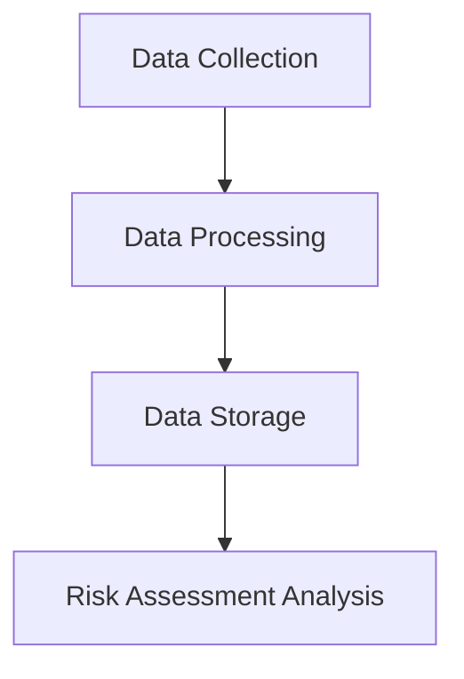
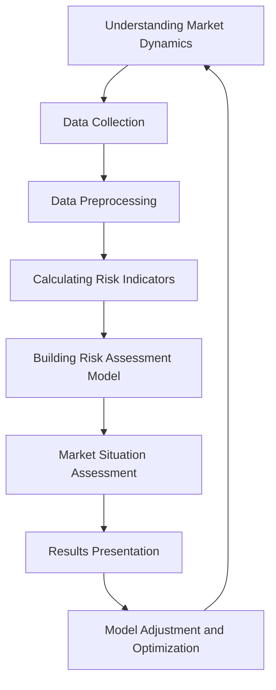
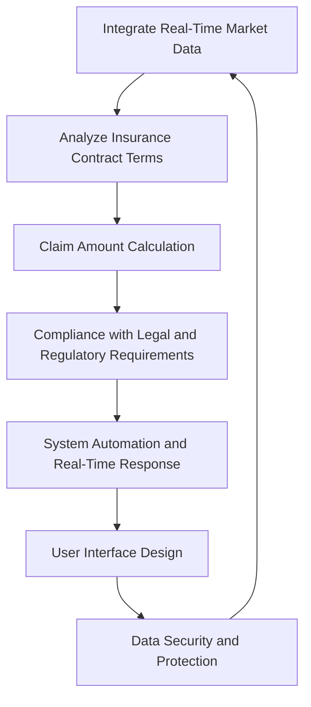

# BTI Finance Model

## 1. Data Collection and Processing

Figure 4.5.1 - Data Collection and Processing

In the construction of a virtual currency futures contract risk assessment system, the data collection and processing phase is crucial. The main steps and key points are as follows:

**1.1. Data Collection**

Obtain information from multiple data sources, including real-time market data provided by market data providers such as CoinMarketCap and CoinGecko, such as price trends, trading volumes, and market capitalization.

Retrieve the latest transaction information by connecting to major virtual currency exchanges' APIs, such as Binance and Coinbase, including buy and sell orders, transaction prices, and quantities.

Monitor financial news and social media channels to capture information about market sentiment and significant events, which is particularly important for understanding the dynamics of the virtual currency market.

**1.2. Data Processing**

**Data Cleansing**: Remove or correct errors, duplicates, inconsistencies, or missing data in the dataset to ensure the accuracy and reliability of the data.

**Data Standardization**: Convert data in different formats or units into a unified format, such as a unified timestamp format, for ease of subsequent analysis.

**1.3. Data Storage**

Choose an appropriate database based on system requirements and data volume. For systems handling large amounts of data, high-performance database management systems like MySQL or PostgreSQL may be required. For scenarios that require greater flexibility and scalability, NoSQL databases like MongoDB may be more suitable.

**1.4. Risk Assessment Analysis**

Use processed data to calculate various risk indicators, such as volatility, liquidity metrics, leverage ratios, and market capitalization.

Apply complex mathematical models and algorithms for calculations, such as using formulas for standard deviation or variance from statistics to calculate volatility, or analyzing trading volumes and bid-ask spreads to assess liquidity.

**1.5. Summary**

Overall, the accuracy, completeness, and consistency of data form the foundation for the effective operation of a risk assessment system. High-quality data processing ensures the quality and availability of data, and provides a solid foundation for subsequent risk assessment analysis, thereby helping to accurately evaluate the risks of virtual currency futures contracts.

## 2. Futures Contract Risk Assessment System

Figure 4.5.2 - Futures Contract Risk Assessment System

Implementing a risk assessment model for virtual currency futures contracts is a multi-level and complex process aimed at providing investors with in-depth market risk analysis and predictions. This process encompasses the following key steps:

**2.1. Understanding Market Dynamics**:

Recognizing the differences between the virtual currency market and traditional financial markets, such as high volatility, liquidity issues, and sensitivity to global economic events and policy changes.

**2.2. Data Collection**:

Collecting relevant data, including historical prices, trading volumes, bid-ask spreads, and other market data, obtained through APIs from virtual currency exchanges or market data providers.

Considering non-structured data like social media and news reports to capture market sentiment.

**2.3. Data Preprocessing**:

Including data cleaning, standardization, or normalization to ensure data quality and consistency.

**2.4. Calculating Risk Indicators**:

Such as volatility, liquidity indicators, and leverage ratio to assess market instability and investment risk.

**2.5. Building Risk Assessment Models**:

Combining statistical and financial analysis methods, using historical data statistical models (such as moving averages, exponential smoothing, or ARIMA) to forecast market trends and volatility.

For complex analysis, employing machine learning methods such as regression analysis, decision trees, or neural networks to learn patterns from historical data and predict future market behavior.

**2.6. Market Situation Assessment**:

Conducting Value at Risk (VaR) analysis to estimate potential maximum losses within a specific time frame.

Using Monte Carlo simulations to generate potential market price paths for risk evaluation.

**2.7. Presentation of Results**:

Presenting risk assessment results through data visualization intuitively and understandably.

**2.8. Model Adjustment and Optimization**:

Regularly adjusting and optimizing the model based on market changes and feedback to accurately capture market dynamics.

**2.9. Conclusion**

The aforementioned risk assessment model for virtual currency futures contracts is a dynamic system that combines market data analysis, statistical methods, and financial theories to provide investors with a comprehensive risk perspective. It is not only an essential tool for investors to understand and respond to market changes but also an evolving system that requires continuous adjustments and improvements to adapt to market fluctuations. Through this comprehensive approach, the virtual currency futures contract risk assessment model can provide in-depth insights to help investors navigate the highly volatile virtual currency market, maximizing investment returns while controlling risk exposure.

## 3. Insurance Claims Calculation System

Figure 4.5.3 - Insurance Claims Calculation System

Implementing a virtual currency futures contract insurance claims calculation system is a complex and precise task that involves multiple key steps and considerations:

**3.1. Integration of Real-Time Market Data**:

Retrieve real-time market data from major exchanges' APIs, including virtual currency price fluctuations, trading volumes, and market sentiment.

**3.2. Analysis of Insurance Contract Terms**:

Analyze the collected market data based on the specific terms of the insurance contract, such as coverage scope, claims conditions, and limits.

Claims conditions may include specific market events (e.g., price dropping to a certain level) or forced position liquidation.

**3.3. Calculation of Claim Amount**:

Consider the contract's leverage ratio and position size to predict potential market losses based on risk assessment models such as Value at Risk (VaR) or Conditional Value at Risk (CVaR), thereby determining the claim amount.

**3.4. Compliance with Legal and Regulatory Requirements**:

Take into account the policyholder's specific location to ensure compliance with different jurisdictions' legal and regulatory requirements.

**3.5. System Automation and Real-Time Responsiveness**:

The system needs to have high automation and real-time responsiveness to quickly and accurately calculate the claim amount when the claim conditions are met.

**3.6. User Interface Design**:

Design a user-friendly interface that allows policyholders to easily access policy details, monitor market conditions, and understand claim calculation results.

**3.7. Data Security and Protection**:

Implement robust security measures to protect sensitive data, such as using encryption technology and conducting regular security audits.

**3.8. Conclusion**

By implementing such a comprehensive system, the calculation of virtual currency futures contract insurance claims can ensure fairness, transparency, efficiency, and accuracy, effectively serving investors and insurance providers. This not only enhances the reliability of insurance services but also provides investors with more confidence and protection, thereby promoting stability and maturity in the virtual currency market.