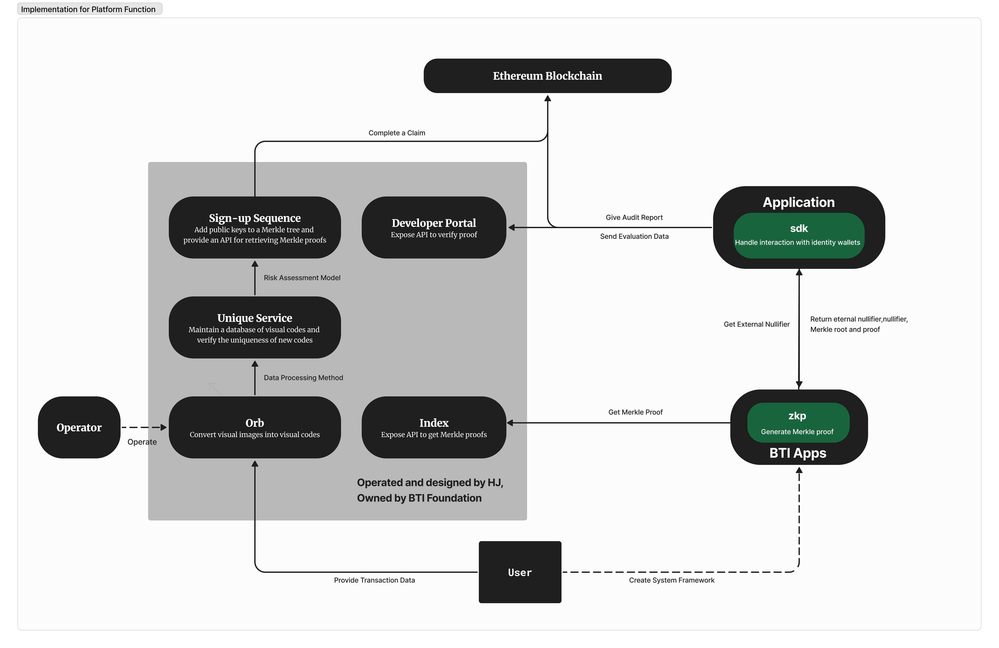
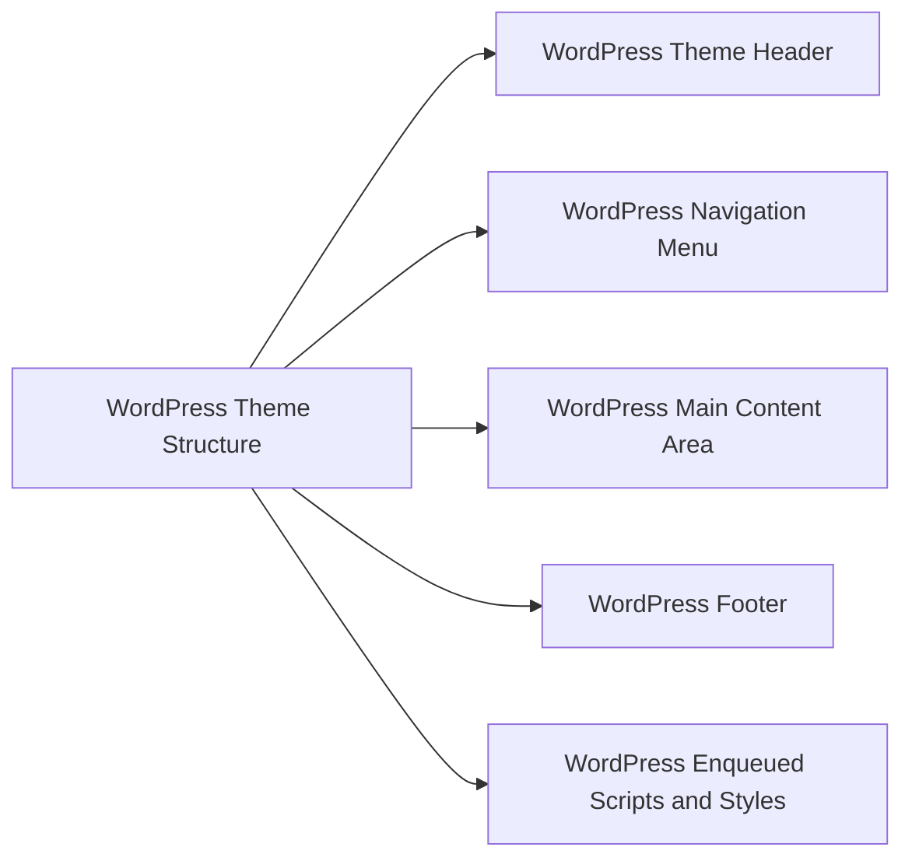
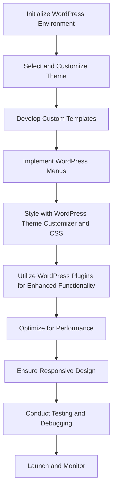
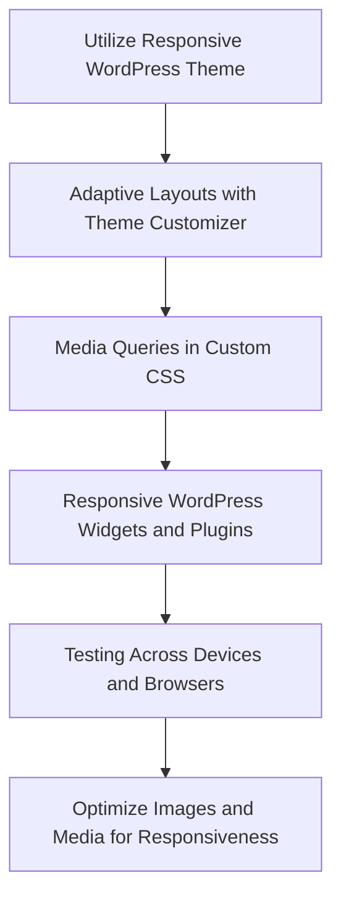
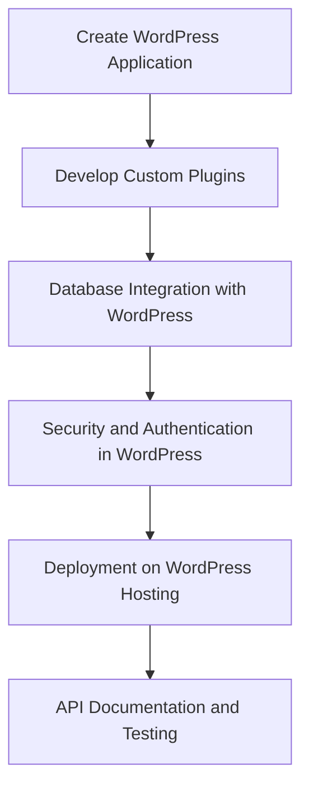
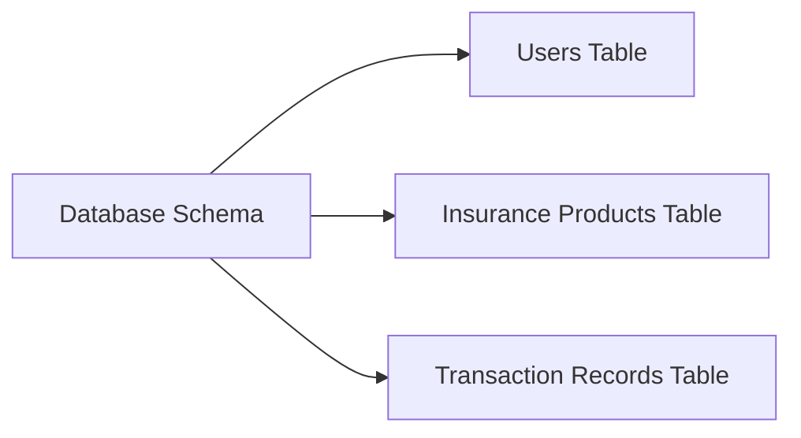
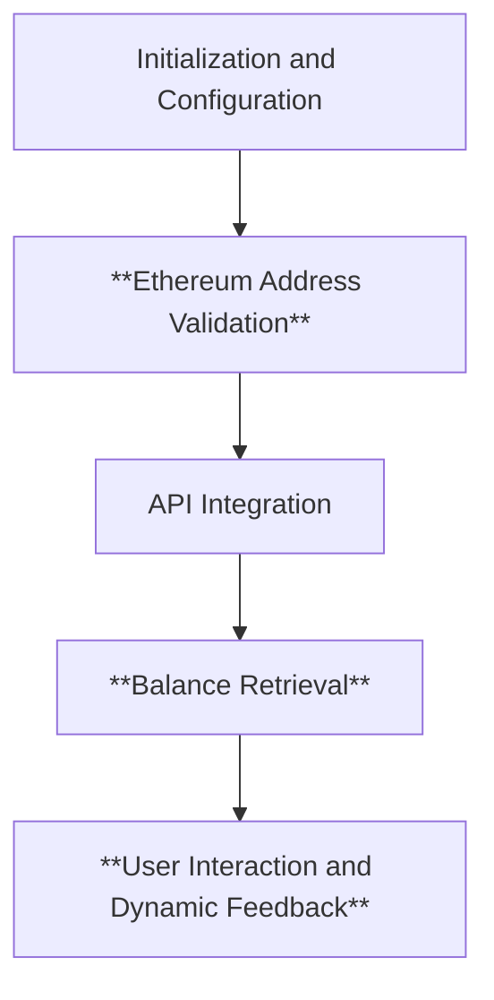
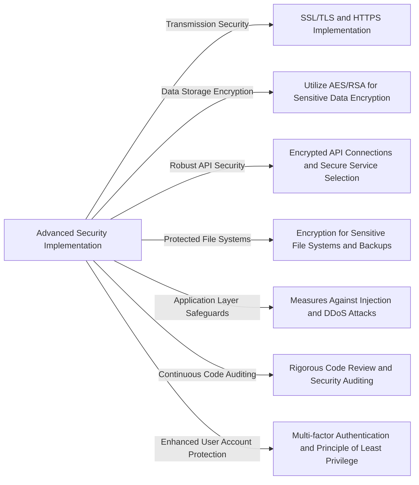
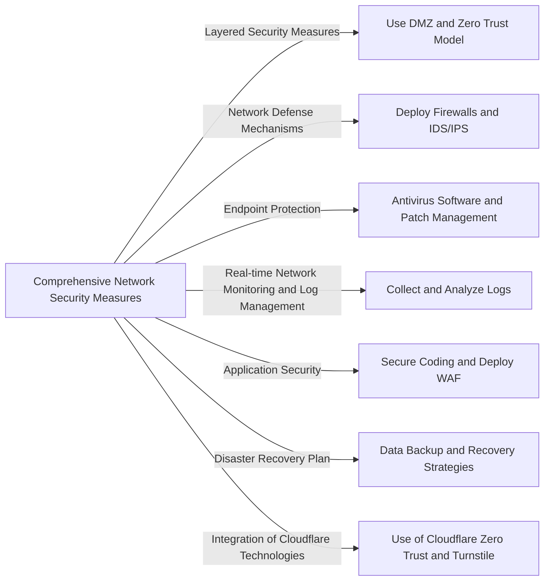
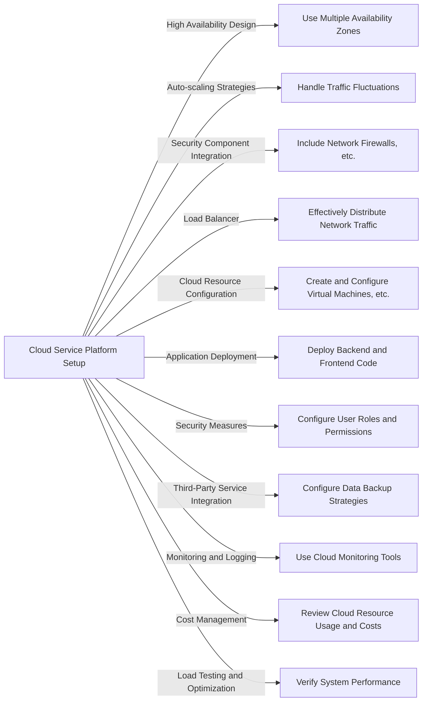

# BTI Website Architecture



## 1. BTI Platform Frontend Development

### 1.1. HTML for Building the Basic Structure and Style of the Website



In the context of a WordPress-powered site, the frontend structure and styling are managed primarily through the theme's template files and functions.

**1.1.1. WordPress Theme Header (header.php)**

```html
<!DOCTYPE html>
<html <?php language_attributes(); ?>>
<head>
    <meta charset="<?php bloginfo( 'charset' ); ?>">
    <meta name="viewport" content="width=device-width, initial-scale=1">
    <title><?php bloginfo('name'); ?> | <?php is_front_page() ? bloginfo('description') : wp_title(''); ?></title>
    <?php wp_head(); ?>
</head>
```

The header template (**`header.php`**) in WordPress defines the document type and head section. It includes the site's character encoding, viewport settings, dynamic title tag, and the **`wp_head()`** function to enqueue theme styles and scripts.

**1.1.2. WordPress Navigation Menu**

```html
<body <?php body_class(); ?>>
    <nav class="navbar navbar-expand-lg navbar-custom">
        <?php if ( has_custom_logo() ) : ?>
            <?php the_custom_logo(); ?>
        <?php else : ?>
            <a class="navbar-brand" href="<?php echo home_url(); ?>"><?php bloginfo('name'); ?></a>
        <?php endif; ?>
        <?php
        wp_nav_menu( array(
            'theme_location' => 'primary',
            'container' => 'div',
            'container_class' => 'collapse navbar-collapse',
            'menu_class' => 'navbar-nav mr-auto',
        ) );
        ?>
    </nav>
```

The navigation menu in WordPress is typically implemented using **`wp_nav_menu()`**, which dynamically generates a menu based on user-defined locations and settings in the WordPress admin area.

**1.1.3. WordPress Main Content Area (index.php, page.php, single.php, etc.)**

```html
<div class="container">
    <?php if ( have_posts() ) : while ( have_posts() ) : the_post(); ?>
        <h1><?php the_title(); ?></h1>
        <?php the_content(); ?>
    <?php endwhile; endif; ?>
</div>
```

The main content area of a WordPress site is managed through various template files like **`index.php`**, **`page.php`**, **`single.php`**, etc. These files typically contain a loop that displays content dynamically based on the current query.

**1.1.4. WordPress Footer (footer.php)**

```html
<footer class="text-center text-lg-start bg-light text-muted">
    <section class="d-flex justify-content-center justify-content-lg-between p-4 border-bottom">
        <?php dynamic_sidebar('footer-1'); ?>
    </section>
    <?php wp_footer(); ?>
</footer>
</body>
</html>
```

The footer (**`footer.php`**) often includes dynamic sidebars for widgets and the **`wp_footer()`** function, which is crucial for enqueuing additional scripts and performing necessary actions by WordPress plugins and themes.

**1.1.5. WordPress Enqueued Scripts and Styles (functions.php)**

In WordPress, JavaScript libraries and stylesheets are typically enqueued in the **`functions.php`** file of the theme using the **`wp_enqueue_script()`** and **`wp_enqueue_style()`** functions. This practice ensures proper loading and dependency management.

```php
function bti_enqueue_scripts() {
    wp_enqueue_style('bootstrap', 'https://stackpath.bootstrapcdn.com/bootstrap/4.3.1/css/bootstrap.min.css', array(), '4.3.1');
    wp_enqueue_script('jquery');
    wp_enqueue_script('popper', 'https://cdnjs.cloudflare.com/ajax/libs/popper.js/1.14.7/umd/popper.min.js', array(), '1.14.7', true);
    wp_enqueue_script('bootstrap-js', 'https://stackpath.bootstrapcdn.com/bootstrap/4.3.1/js/bootstrap.min.js', array('jquery', 'popper'), '4.3.1', true);
}
add_action('wp_enqueue_scripts', 'bti_enqueue_scripts');
```

In this setup, the structure and styling of the BTI platform's frontend are managed within the context of WordPress, ensuring seamless integration with the CMS's functionality and features.

### 1.2. Frontend Framework



In the development of the BTI platform's frontend, a bespoke approach was adopted, centered around a custom-designed WordPress theme. This theme, uniquely crafted to meet the specific needs of the virtual currency contract trading insurance platform, serves as the cornerstone of the site's design and functionality.

**1.2.1. Custom Theme Development**

The process began with the meticulous development of a custom WordPress theme. This theme was designed from the ground up to embody the unique brand identity of the BTI platform, ensuring a distinctive and cohesive user experience. This tailored approach allowed for greater control over both aesthetics and functionality, setting the foundation for a highly customized and intuitive user interface.

**1.2.2. Theme Customization and Brand Integration**

Once the custom theme was established, it was further refined to align seamlessly with the platform's branding. Key elements such as color schemes, typography, and layout were tailored to resonate with the brand's ethos and visual identity. This customization extended beyond mere aesthetics, encompassing functional elements that directly cater to the platform's operational needs.

**1.2.3. Specialized Template Creation**

To accommodate the varied content and interaction requirements of the platform, specialized templates were created within the custom theme. These templates were designed to deliver content in an engaging and user-friendly manner, tailored to the different types of information and services offered by the platform, such as detailed insurance product descriptions, trading tools, and customer support resources.

**1.2.4. Navigation Structure and User Journey**

The custom theme facilitated the development of a well-structured navigation system, designed to guide users effortlessly through the site. This structure was instrumental in creating a coherent and intuitive user journey, enhancing the overall usability of the platform.

**1.2.5. Enhanced Styling and Interactive Elements**

With the flexibility afforded by a custom theme, enhanced styling and interactive elements were integrated to elevate the user experience. This included animations, interactive widgets, and custom graphics, all harmoniously blended into the site's design to create a dynamic and engaging interface.

**1.2.6. Optimized Performance and Responsive Design**

A key focus in the theme development was optimizing for performance and ensuring responsive design. The custom theme was built with a mobile-first approach, guaranteeing a seamless experience across all devices, and optimized for fast loading times, crucial for user engagement and search engine ranking.

**1.2.7. Rigorous Testing and Refinement**

The custom theme underwent extensive testing across various browsers and devices to ensure flawless functionality and appearance. This phase was crucial in identifying and rectifying any issues, ensuring the site's stability and reliability.

**1.2.8. Deployment and Continuous Improvement**

Upon completion and thorough testing, the custom-themed website was deployed. Post-launch, continuous monitoring and iterative improvements were implemented, ensuring the platform remains cutting-edge and responsive to user feedback and evolving market needs.

In essence, the BTI platform's frontend, powered by a custom-designed WordPress theme, stands as a testament to the brand's commitment to providing a unique, efficient, and user-centric experience in the virtual currency contract trading insurance domain.

### 1.3. Responsive Design



In the context of WordPress, implementing responsive design for the BTI platform's virtual currency contract trading insurance website involves a series of steps to ensure that the site is visually appealing and functional across all device types and screen sizes.

**1.3.1. Utilizing a Responsive WordPress Theme**

The foundation of responsive design in WordPress is the selection of a theme that is inherently responsive. This ensures that the basic layout and elements of the site adapt to different screen sizes from the outset.

**1.3.2. Adaptive Layouts with Theme Customizer**

Using the WordPress Theme Customizer, layouts can be adapted and fine-tuned. This includes adjusting margins, paddings, and other layout properties to ensure that they respond dynamically to various screen sizes.

**1.3.3. Media Queries in Custom CSS**

Incorporate custom CSS with media queries to apply specific styling rules for different screen sizes. This allows for more granular control over how elements appear and behave on various devices.

```css
@media (max-width: 768px) {
  .header-nav {
    /* Adjustments for mobile navigation */
  }
  .main-content {
    /* Style changes for smaller screens */
  }
}
```

**1.3.4. Responsive WordPress Widgets and Plugins**

Leverage responsive WordPress widgets and plugins to ensure all components of the website, including sliders, forms, and other interactive elements, are mobile-friendly.

**1.3.5. Testing Across Devices and Browsers**

Conduct thorough testing of the website across a range of devices and browsers. This step is crucial to identify and rectify any issues that might affect the site’s performance or appearance on different platforms.

**1.3.6. Optimize Images and Media for Responsiveness**

Ensure that images and other media elements are optimized for responsiveness. This includes using appropriate file sizes, utilizing WordPress's built-in responsive image features, and applying CSS techniques to adjust images dynamically.

```html
<picture>
  <source media="(min-width: 650px)" srcset="large-photo.jpg">
  <source media="(min-width: 465px)" srcset="medium-photo.jpg">
  
</picture>
```

By following these steps, the BTI platform ensures that its WordPress site offers an optimal viewing experience across all devices, enhancing accessibility and user engagement. Responsive design is not just about visual appeal but also about ensuring functionality and ease of use, regardless of how users access the site.

## 2. BTI Platform Backend Development

### 2.1. Server Logic



In this section, we delve into the intricacies of developing the backend for the BTI platform, particularly focusing on integrating and optimizing it within the WordPress environment. This approach capitalizes on WordPress's robust, flexible nature, offering an expansive array of plugins and themes, coupled with a user-friendly content management system. Our strategic decision to harness WordPress as our core backend framework allows for seamless scalability, advanced user management, and efficient implementation of complex functionalities such as e-commerce and data analytics.

**2.1.1. Creating a WordPress Application**

The foundation of the BTI platform's backend is a WordPress application, chosen for its widespread use and extensive support community. The initial step involves setting up a WordPress site through a reliable hosting service, ensuring optimal compatibility and performance. Following installation, the site is customized using themes and plugins to align with the functional and aesthetic requirements of the platform.

**2.1.2. Developing Custom Plugins**

To address specific needs not met by existing plugins, we undertake the development of custom WordPress plugins. This process involves programming in PHP and utilizing WordPress's REST API for advanced data handling and user interactions. The development of these plugins is guided by stringent coding standards and best practices to ensure high performance and security.

**2.1.3. Database Integration with WordPress**

At the heart of our application lies the integration with WordPress's default MySQL database. This integration facilitates the management of custom data structures, particularly in handling insurance products and transaction records, while leveraging WordPress's robust database functions for efficient data storage and retrieval.

**2.1.4. Security and Authentication in WordPress**

Recognizing the paramount importance of security, the platform is fortified using WordPress's array of security features and specialized plugins. User authentication is managed through WordPress's comprehensive user management system, augmented with additional security measures such as two-factor authentication and single sign-on capabilities through plugin extensions.

**2.1.5. Deployment on WordPress Hosting**

Deployment is executed on a hosting service specializing in WordPress, ensuring an environment that is optimized for both performance and security. Our hosting strategy includes regular backups, proactive security scanning, and timely updates, safeguarding the platform against potential threats and ensuring uninterrupted service.

**2.1.6. API Documentation and Testing**

To guarantee the reliability and maintainability of the platform's backend, thorough documentation and testing of all APIs, especially those developed for custom plugins, are conducted. Tools such as Postman for API testing and Swagger for API documentation are employed, providing clarity and ease of use for future development and integration processes.

### 2.2. Database Technology



Within the WordPress framework, we have strategically designed a database schema that seamlessly integrates with the existing WordPress database structure while accommodating the specific data requirements of our platform.

**2.2.1. User Table (wp_users)**

The platform utilizes WordPress's native **`wp_users`** table for managing user data. To extend the user information capabilities, we employ WordPress's user metadata functions alongside custom tables, ensuring a comprehensive and flexible user data management system.

**2.2.2. Insurance Products Table (Custom Insurance Products)**

A custom table, specifically designed for insurance product data, is created within the WordPress database. This table is meticulously structured to store detailed information about each insurance product, catering to the unique aspects of our insurance offerings.

```sql
CREATE TABLE wp_insurance_products (
    ProductID INT AUTO_INCREMENT PRIMARY KEY,
    Name VARCHAR(255) NOT NULL,
    Description TEXT,
    Price DECIMAL(10, 2) NOT NULL
);
```

**2.2.3. Transaction Records Table (Custom Transaction Records)**

To record and manage the transaction history of our users, a dedicated table is established. This table is intricately linked with both the WordPress user table and the custom insurance products table, ensuring a cohesive and comprehensive record-keeping system.

```sql
CREATE TABLE wp_transaction_records (
    RecordID INT AUTO_INCREMENT PRIMARY KEY,
    UserID INT,
    ProductID INT,
    TransactionDate TIMESTAMP DEFAULT CURRENT_TIMESTAMP,
    Amount DECIMAL(10, 2) NOT NULL,
    FOREIGN KEY (UserID) REFERENCES wp_users(ID),
    FOREIGN KEY (ProductID) REFERENCES wp_insurance_products(ProductID)
);
```

The meticulous planning and execution of the BTI platform's backend development within the WordPress ecosystem pave the way for a robust, scalable, and user-friendly platform, perfectly poised to meet the dynamic demands of virtual currency contract trading insurance.

### 2.3. API Development and Integration



The BTI platform's integration with the Ethereum blockchain through the Infura API is a critical component in providing real-time data and transaction capabilities. The following description outlines the implementation details based on the provided code, highlighting key functionalities and their significance in the overall system.

**2.3.1. Initialization and Configuration**

The platform initializes a connection to the Ethereum blockchain using the Infura API. This is achieved by creating an instance of the **`Web3`** object with Infura's Mainnet URL, ensuring a stable and secure connection to the Ethereum network. This setup is crucial for enabling real-time interactions with the blockchain, including querying balances and executing transactions.

**2.3.2. Ethereum Address Validation**

A significant feature of the implementation is the validation of Ethereum addresses. The system checks if a provided username (which is an Ethereum address) is in a valid format using **`web3.utils.isAddress`**. This validation is essential to ensure that the platform interacts with correctly formatted Ethereum addresses, thereby reducing errors and potential security risks in transactions.

**2.3.3. Balance Retrieval**

Upon validating the Ethereum address, the platform retrieves the balance of the address in both Ethereum (ETH) and BTI tokens. This is performed through the **`web3.eth.getBalance`** function, which queries the Ethereum blockchain for the balance of the specified address. The balance is then converted from Wei to Ether for readability. Displaying both ETH and BTI balances provides users with a comprehensive view of their holdings.

**2.3.4. User Interaction and Dynamic Feedback**

The implementation integrates key functionalities for enhanced user interaction and dynamic feedback:

- **User Feedback and Error Handling:** The platform immediately communicates the results of Ethereum address validation and balance retrieval to the user. It displays success messages or error notifications, ensuring users are promptly informed about the status of their requests.
- **Updating User Status:** Following validation, the system updates the user's status via an AJAX request to a server-side PHP script. This step ensures the user's information on the platform is in sync with the Ethereum address validation results.
- **Dynamic UI Updates:** The platform employs dynamic UI changes, such as hiding certain elements following successful operations. A MutationObserver is used to track real-time changes in the user interface, ensuring the UI is responsive and reflects the current state of user interactions.

These integrated features emphasize real-time feedback, seamless user experience, and consistent data synchronization, making the BTI platform robust and user-centric.

## 3. BTI Platform Security Technologies

### 3.1. Encryption Technology



The BTI platform has implemented a robust array of security measures to safeguard its virtual currency contract trading insurance platform:

**3.1.1. Data Transmission Security**

SSL/TLS encryption and strict HTTPS protocols are enforced to secure data during transmission, guarding against man-in-the-middle attacks and unauthorized data access.

**3.1.2. Data Storage Encryption**

Sensitive data, including user credentials and transaction details, are protected using advanced encryption standards like AES or RSA. Strong hash functions are employed for password storage.

**3.1.3. Robust API Security**

API interactions, particularly those with external services like Infura, are secured through encrypted connections. The platform opts for third-party services that prioritize strong encryption protocols.

**3.1.4. Protected File Systems**

File systems containing sensitive data are encrypted, along with all backups, ensuring comprehensive data protection across all storage environments.

**3.1.5. Application Layer Safeguards**

Application layer security includes validation and sanitization of user inputs to prevent injection attacks and measures against XSS, CSRF, and DDoS attacks.

**3.1.6. Continuous Code Auditing**

Regular code reviews and security audits are conducted to identify and rectify potential vulnerabilities, along with keeping libraries and dependencies updated.

Through these advanced and integrated security measures, the BTI platform ensures a fortified defense against cyber threats, maintaining the integrity and reliability of its services.

### 3.2. Network Security Measures



The comprehensive network security measures implemented by the BTI platform are aimed at protecting the platform and its user data, as well as effectively reducing potential risks. These measures include:

**3.2.1. Layered Security Measures**

Implement layered security in the network architecture, for example, by using a DMZ (Demilitarized Zone) to isolate the internal network and critical systems, and adopting a zero-trust network model to ensure each access is strictly authenticated and authorized.

**3.2.2. Network Defense Mechanisms**

Deploy network firewalls and Intrusion Detection and Prevention Systems (IDS/IPS) to monitor and control network data flow, as well as to detect and respond to suspicious activities and known attack patterns.

**3.2.3. Endpoint Protection**

Install antivirus software on servers and workstations and regularly update them, combined with continuous patch management to fix known security vulnerabilities.

**3.2.4. Real-Time Network Monitoring and Log Management**

Implement real-time network monitoring and log management, collect and analyze logs from networks, servers, and applications, and detect and investigate security events.

**3.2.5. Application Security**

Follow secure coding practices to reduce security vulnerabilities in applications, and deploy Web Application Firewalls (WAF) to protect websites and APIs from web attacks.

**3.2.6. Disaster Recovery Plan**

Regularly back up critical data and store it in secure locations, while formulating and testing disaster recovery plans to ensure quick recovery in the event of a security incident.

**3.2.7. Integration of Cloudflare Technologies**

To further enhance security, Cloudflare Zero Trust is used for secure dashboard panel access, and Cloudflare Turnstile is implemented to differentiate between bots and real users, adding an additional layer of security.

Through these comprehensive security measures, the BTI platform not only significantly enhances its security but also effectively responds to the constantly evolving network threats and challenges, ensuring the long-term safety of the platform and its users.

## 4. Building a Cloud Service Platform



BTI platform comprehensively considered various factors when constructing the cloud service platform and selected Vultr as the cloud service provider. Below are the key measures in cloud architecture design and management:

**4.1. High Availability Design**

Use multiple availability zones to ensure service continuity, making sure that services will not be interrupted in the event of a failure in any one region.

**4.2. Auto-scaling Strategy**

Implement an auto-scaling strategy to cope with traffic fluctuations, ensuring resources are automatically increased during high demand.

**4.3. Integration of Security Components**

The architecture includes network firewalls, intrusion detection systems, and data encryption among other security components to protect cloud resources from threats.

**4.4. Load Balancers**

Use load balancers to effectively distribute network traffic, ensuring stable and efficient service.

**4.5. Cloud Resource Configuration**

Create and configure virtual machines or containers as needed, set up database services, configure object storage and/or block storage, as well as virtual private clouds and subnets.

**4.6. Application Deployment**

Deploy backend and frontend code in the cloud environment, automate the deployment process using CI/CD pipelines, and manage configurations with tools like Ansible and Terraform.

**4.7. Security Measures**

Configure users, roles, and permissions with IAM services, implement data transfer and static data encryption, and monitor security events with cloud monitoring tools.

**4.8. Integration of Third-Party Services**

Configure data backup strategies and test the recovery process to ensure data security and recoverability.

**4.9. Monitoring and Logging**

Monitor application performance using cloud monitoring tools, collect and analyze logs to promptly discover and resolve issues.

**4.10. Cost Management**

Regularly review the usage and cost of cloud resources, optimize resource configurations to reduce expenses, and choose suitable service plans.

**4.11. Load Testing and Optimization**

Conduct load testing to verify the system's performance and reliability, and optimize architecture and configurations based on test results and actual operational data.

Through these comprehensive measures, the BTI platform has established a secure and efficient cloud service environment on Vultr’s cloud services.