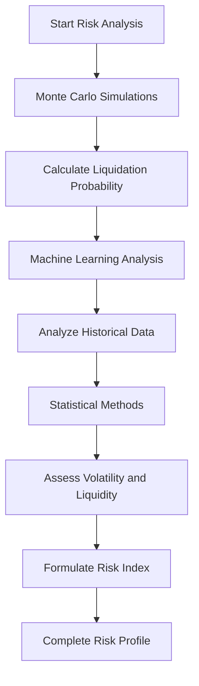
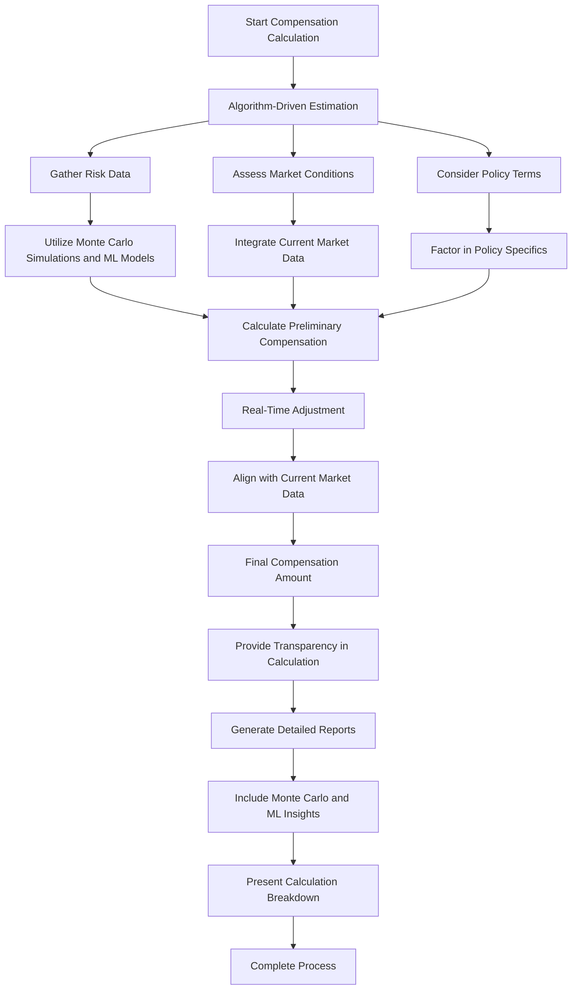
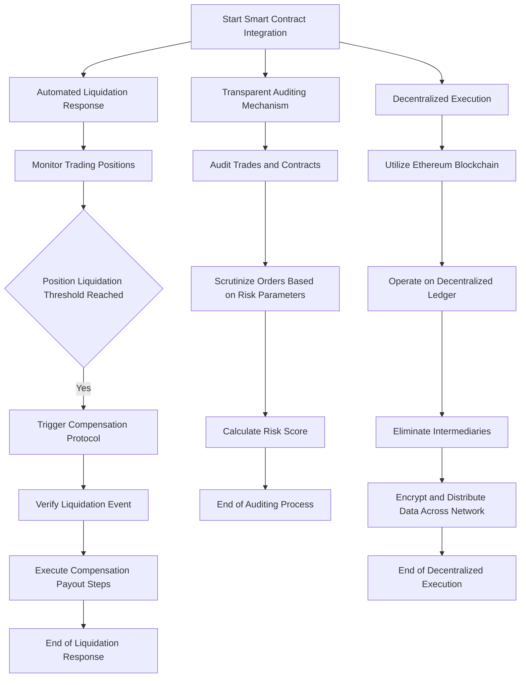
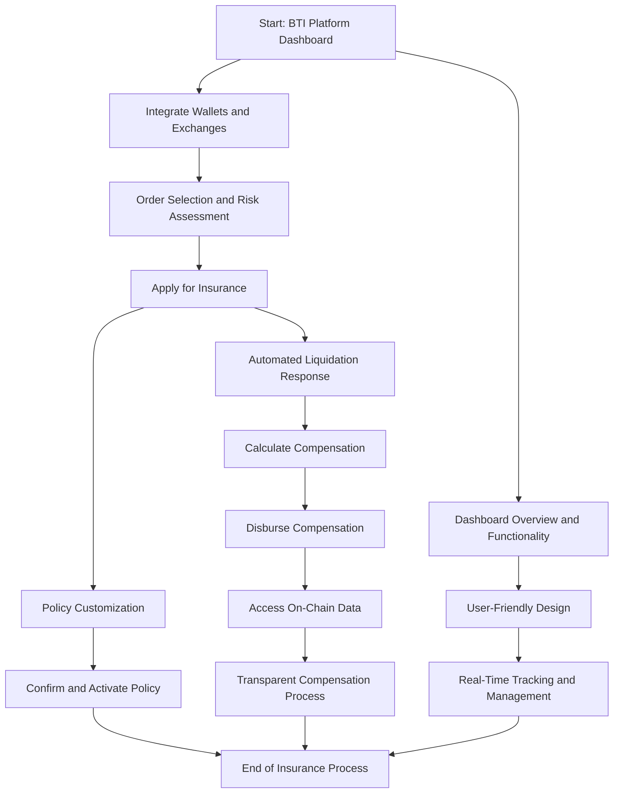

# BTI Insurance Technology

## Introduction

The Bit Trading Insurance (BTI) platform revolutionizes risk assessment and compensation determination in high-leverage cryptocurrency trading. This comprehensive platform integrates sophisticated algorithms with Ethereum-based smart contracts, creating a seamless insurance process from policy issuance to compensation payout.

## Enhanced Risk Analysis and Compensation Determination

Leveraging a blend of Monte Carlo simulations, machine learning models, and complementary statistical methods, BTI offers an in-depth risk assessment and dynamic compensation calculation:

### In-Depth Risk Assessment

1. **Monte Carlo Simulations**: Essential for forecasting potential market scenarios, this algorithm estimates the probability of contract liquidation by simulating diverse market conditions.
    
    Here's a streamlined overview of our implementation process:
    
    - Let $*P(L)*$ be the probability of liquidation.
    - Conduct $*N*$ simulations, each representing a different market scenario.
    - In each simulation, calculate price change $\Delta P$ based on a normal distribution reflecting market volatility.
    - If $\Delta P$ leads to a contract value drop beyond the liquidation threshold, count it as a liquidation event.
    - Count the number of liquidation events $*L*$.
    - Calculate $*P(L)=\frac{N}{L}*$.
2. **Machine Learning Algorithms Using Polynomial Regression**: Our approach utilizes polynomial regression to analyze historical market data, thereby refining risk assessments with enhanced precision. This method excels in identifying subtle patterns and predicting market events, thanks to its ability to model complex, non-linear relationships. The implementation process is outlined as follows:
    - **Data Preparation**: We start by gathering historical market data, which serves as the input variables, denoted as $*X*$.
    - **Polynomial Regression Model Training**: A polynomial regression model is employed for its ability to capture non-linear trends in data. This model is trained to predict a risk score, denoted as $*Y*$.
    - **Learning the Polynomial Function**: The polynomial regression model learns a non-linear function $*f*$, where the predicted risk score $*Y*$ is a polynomial function of the input variables $*X*$, represented as $*Y=f(X)*$. The degree of the polynomial is chosen based on the complexity of the data.
    - **Model Retraining and Updating**: To ensure the model remains current and accurate, it is regularly retrained with new market data. This continuous updating allows the model to adapt to evolving market conditions and maintain its predictive accuracy.
    
    By adopting polynomial regression, we can model more intricate relationships within the market data than linear models, leading to a more nuanced and accurate risk assessment.
    
3. **Complementary Statistical Methods**: These methods evaluate various market risk factors, such as volatility and liquidity depth, to provide a comprehensive risk profile for each contract order.
    
    Here's a streamlined overview of our implementation process:
    
    - For volatility assessment, calculate the standard deviation $*\sigma*$ of historical price changes.
    - For liquidity depth, analyze order book data to compute a liquidity score $*L_{q}*$.
    - Combine these metrics with other factors to form a composite risk index $*R*$ for each order.
    - $*R*$ might be a weighted sum of different risk metrics, i.e., $*R=w_1 \cdot \sigma+w_2 \cdot L_q+\ldots*$, where $*w_{i}*$ are weights.

## Dynamic Compensation Calculation

1. **Algorithm-Driven Estimation**
    - **Process**: When a trading order faces liquidation, the platform immediately initiates a compensation calculation process. This is not a static formula but a dynamic computation influenced by a multitude of factors.
    - **Factors Considered**:
        - **Risk Data**: Utilizes outputs from Monte Carlo simulations that provide probabilistic market scenarios and machine learning models that have analyzed historical data patterns.
        - **Market Conditions**: Current market data, including volatility indices, liquidity metrics, and recent market trends, are integrated into the calculation.
        - **Policy Terms**: Each insurance policy's specific terms, such as coverage limits and premium rates, are factored into the computation.
    - **Outcome**: The final compensation amount is a calculated figure that reflects the confluence of these diverse data points, tailored to the specific conditions of each liquidated order.
    - **Real-Time Adjustment**: Compensation mechanisms adjust in real-time, ensuring alignment with current market realities and specific risk profiles.
    - **Transparency in Calculation**: Users have access to detailed reports on their compensation, including insights from the Monte Carlo simulations and machine learning predictions.
2. **Real-Time Adjustment**
    - **Adaptability**: The compensation mechanism is designed to be highly responsive, adapting to changes in market conditions as they occur.
    - **Functionality**: As the cryptocurrency market is known for its volatility, the system continuously updates its risk assessment and compensation calculations to align with the latest market data.
    - **Benefit**: This ensures that the compensation amount is always relevant and accurately reflects the risk at the time of order liquidation.
3. **Transparency in Calculation**
    - **User Access**: Users are provided with comprehensive reports detailing how their compensation amount was determined.
    - **Content of Reports**: These reports include:
        - **Monte Carlo Analysis**: Insights into the various market scenarios simulated and their probabilities.
        - **Machine Learning Insights**: Information on historical trends and patterns that influenced the prediction models.
        - **Calculation Breakdown**: A detailed breakdown of how each factor contributed to the final compensation amount.
    - **Advantage**: This level of transparency builds trust with users, as they can clearly understand the basis for their compensation.

## Smart Contract Integration

The backbone of the Bit Trading Insurance (BTI) platform is its innovative integration of Ethereum-based smart contracts. These smart contracts are meticulously programmed to automate and manage the insurance process with an unprecedented level of impartiality and decentralization.

1. **Automated Liquidation Response**
    - **Mechanism**: The smart contracts are coded to monitor trading positions in real time. Upon detecting a position reaching its liquidation threshold, the contract automatically triggers the compensation protocol.
    - **Process**: This involves verifying the liquidation event against the contract terms and then executing a series of predefined steps to initiate the compensation payout.
    - **Advantages**: This automation not only speeds up the response to liquidation events but also eliminates human error or bias, ensuring a fair and consistent process for all users.
2. **Transparent Auditing Mechanism**
    - **Audit Protocol**: Every trade and insurance contract is subject to a thorough auditing process. This is carried out by smart contracts that scrutinize each order based on a set of predetermined risk parameters.
    - **Risk Parameters**: These parameters include market volatility, the order’s historical performance, leverage used, and other relevant risk factors. The smart contract uses this data to calculate a risk score for each insured position.
    - **Benefits**: This level of transparency in the auditing process ensures that all stakeholders have a clear understanding of how risk is assessed, fostering a sense of fairness and trust in the platform.
3. **Decentralized Execution**
    - **Blockchain Utilization**: By leveraging the Ethereum blockchain, the BTI platform operates on a decentralized ledger, ensuring that all contract executions and transactions are transparent and tamper-proof.
    - **Elimination of Intermediaries**: The decentralized nature of blockchain technology means there are no intermediaries involved in the insurance process. This leads to reduced costs, increased efficiency, and elimination of potential conflicts of interest.
    - **Enhanced Security and Trust**: With blockchain, every transaction and its associated data are encrypted and distributed across a network of computers, making it virtually impervious to fraud and hacking. This decentralization not only bolsters security but also significantly enhances the trustworthiness of the platform.

## User Interface and Experience

### Dashboard Interface

- **Overview and Functionality**: The BTI platform's dashboard serves as the central hub for user interaction. It is meticulously designed to offer a comprehensive and intuitive view of the user's perpetual contract orders.
- **Integration with Wallets and Exchanges**: Through the use of the Infura API, the dashboard seamlessly integrates with users' cryptocurrency wallets and their exchange accounts. This integration allows for real-time tracking and management of contracts directly from the dashboard.
- **User-Friendly Design**: The interface is crafted for ease of use, with clear navigation, interactive elements, and visual indicators that provide at-a-glance insights into contract status and performance.

### Insurance Process Flow

1. **Wallet and Exchange API Integration**:
    - Users initiate their journey by securely linking their cryptocurrency wallets and exchange accounts to the platform.
    - This integration is critical for enabling direct interaction with contract orders and facilitating insurance processes.
2. **Order Selection and Risk Assessment**:
    - The platform presents users with a risk index next to each contract order.
    - This index is calculated using advanced algorithms, providing users with an immediate understanding of the risk associated with each order.
3. **Insurance Application**:
    - Upon selecting an order, users can apply for insurance.
    - This action triggers an automated risk audit, leveraging the platform’s algorithms to assess the viability and risk level of the insurance application.
4. **Policy Customization**:
    - Users are then able to customize their insurance policy, choosing the type (BTI, USDT, or ETH) and the amount of insurance.
    - Opting to insure with BTI tokens provides the added benefit of a platform-specific discount.
5. **Confirmation and Activation**:
    - The platform calculates and presents an estimated maximum compensation amount based on the chosen policy.
    - Users review and confirm this amount to activate their insurance policy.

### Compensation Mechanism

1. **Automated Liquidation Response and Compensation**:
    - In the event of an order's liquidation, the platform automatically calculates the compensation due to the user.
    - This calculation is based on a predetermined percentage of the total order value, factoring in the specific terms of the user’s insurance policy.
2. **On-Chain Data Accessibility**:
    - Users have the capability to access detailed on-chain data regarding their compensation.
    - This feature ensures transparency in the compensation process, allowing users to view the blockchain-based calculations and transactions that led to their compensation payout.