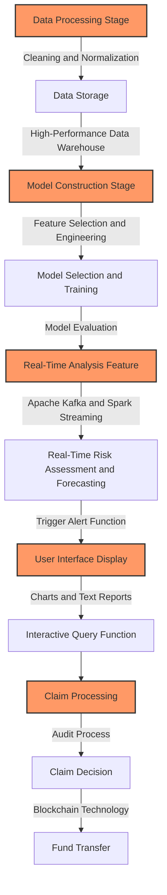
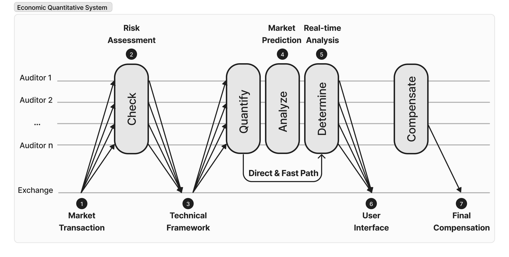
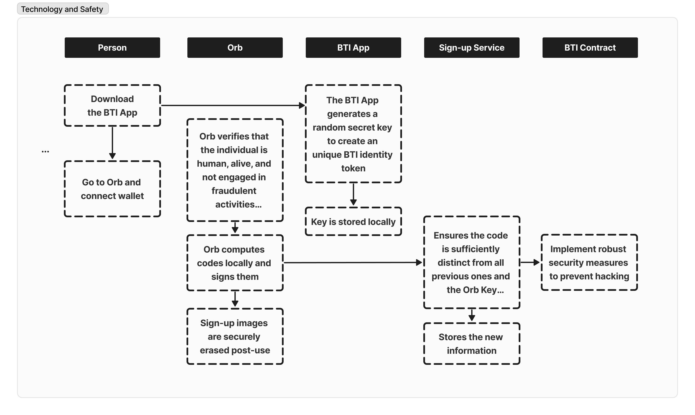

# Introduction of Bit Trading Insurance Platform

### Introduction

The Bit Trading Insurance (BTI) platform is an innovative smart virtual currency trading insurance platform that focuses on providing risk management and asset protection services for virtual currency contract traders, especially those involved in perpetual contract trading. The platform combines decentralized insurance service mechanisms with advanced data processing to offer a unique and comprehensive smart insurance compensation solution for virtual currency investors.

In other industries, traditional insurance platforms often rely heavily on manual operations, including claim processing and customer service, which can lead to longer processing times. In contrast, the blockchain-based BTI smart insurance platform utilizes smart contracts to automate the execution of insurance policies and the claims process, increasing efficiency and shortening processing times. Additionally, the smart insurance platform reduces reliance on intermediaries, establishing direct connections between insurance providers and clients, further lowering operational costs, and thus offering faster and more economical services to users.

As a pioneer in the industry, the BTI platform utilizes precise model construction and real-time analysis to transform big data and advanced analytical technologies into practical user services. This innovative service model not only meets the market's demand for risk management tools but also promotes the maturity and stable development of the entire virtual currency market. The platform's intuitive user interface and automated claims process further reduce investors' risks, enhance transparency and user satisfaction, and make significant contributions to the health and sustainable development of the virtual currency market.

### Core Concept

In the BTI platform, the core of the claims process is the dynamic risk assessment using advanced smart contract technology and complex econometric quantification functions. The platform initially calculates each insured order's dynamic risk index by acquiring a series of key parameters, **such as the insurance coverage amount, policy duration, the size of the position in the contract order, leverage ratio, order type, market trading volume, and liquidity, various technical indicators, the user's past market performance, and economic and macroeconomic factors**.

After a user confirms their insurance, the BTI platform uses smart contract technology to automatically assess and audit the policy. This process includes verifying the policy's compliance, checking the validity of the insurance coverage, and confirming the match between the insurance terms and the user's needs. Smart contracts ensure the assessment process's speed and fairness, completing complex audit tasks without the need for human intervention.

Once a user's contract order triggers the insurance payout conditions, such as encountering a market crash or severe price fluctuations resulting in losses, the smart contract will automatically execute, sending the compensation amount directly to the user's wallet address. This process is not only rapid and transparent, but it also ensures that users receive timely compensation to mitigate their losses.

The automation and intelligence of the entire claims process significantly increase efficiency and reliability, reduce the likelihood of operational errors, and enable the BTI platform to provide a more efficient, transparent, and secure insurance service experience for its users.

### Economic Quantitative System

The platform introduces an advanced economic quantitative system for assessing and managing insurance claims. This system combines market data analysis, risk assessment, and algorithmic models to ensure that all insurance claims are fair, transparent, and efficient. The introduction of this system not only enhances user trust but also strengthens the platform's stability and reliability.

Figure 2.1 - Quantitative Analysis System

The raw data will be collected from various channels, including exchanges, market news, and social media, covering a wide range of trading information such as price fluctuations, trading volume, and order book depth. These data will undergo cleaning to remove noise and irrelevant information, as well as normalization to overcome issues such as time zone differences and inconsistent formats. The cleaned and normalized data will be stored in a high-performance data warehouse, ensuring efficient querying and analysis. Additionally, we employ distributed storage systems and advanced data indexing techniques to further optimize data access efficiency.

During the model construction phase on the BTI platform, feature selection is a crucial step in applying machine learning techniques. This process involves feature engineering, which entails selecting and transforming key variables in the data to more accurately reflect useful information for the predictive model. For example, technical indicators such as moving averages and relative strength index (RSI) may be calculated. Subsequently, the system will automatically select suitable algorithms (including, but not limited to, random forests, support vector machines, or deep learning models) to build the predictive model. These models are trained using historical data to identify market trends and risk patterns. To evaluate the performance of the models, we employ methods such as cross-validation to ensure high accuracy even when facing unseen data.

The real-time analysis functionality is implemented through the integration of Apache Kafka and Spark Streaming, specifically designed for processing market data. These technologies enable the platform to utilize pre-built models for real-time risk assessment and market predictions, providing users with up-to-date market insights. Additionally, the system automatically triggers an alert function to notify users of potential risks when market data reaches predetermined thresholds or exhibits specific patterns. This instant response mechanism enhances the platform's responsiveness and provides users with essential risk management tools.

Evaluated analysis reports are presented to users through charts, indicators, and text reports on the user interface to ensure a clear understanding of market dynamics. Furthermore, the platform offers interactive query capabilities, allowing users to customize data views and analysis reports according to their needs. Users can filter data based on specific time ranges, transaction types, or market trends to obtain personalized analysis results. The user interface is designed with a focus on usability and intuitiveness, incorporating modern UI/UX design principles such as clear layouts, responsive design, and intuitive controls to deliver a more user-friendly and efficient experience.

When a user's trading activity meets the conditions for insurance claims, the BTI platform's system automatically initiates a comprehensive audit process. This process utilizes previously constructed risk assessment models and real-time analysis results to quickly and accurately determine if the claim conditions have been met. Based on the output of the quantitative model and predefined insurance terms, the system automatically or semi-automatically makes claim decisions. In necessary cases, manual audits are also conducted to ensure the accuracy and reasonableness of decisions.

Once the claim decision is confirmed, the system automatically triggers a fund transfer process. Throughout this process, the platform utilizes blockchain technology to ensure the security, transparency, and promptness of claim funds. The use of blockchain enhances not only the security of transactions but also the efficiency and trustworthiness of the entire claim process, providing users with a reliable and efficient claim experience.

### Features and Services \[Web Operation Tutorial Illustration]

The main service provided by the BTI platform is insurance for cryptocurrency perpetual contract trading. Due to the high-leverage nature of these contracts, they involve relatively high risks. The insurance service of the BTI platform aims to provide protection for these high-risk transactions, safeguarding users from account liquidation and substantial losses caused by market volatility.

Users can purchase $BTI tokens to buy insurance for their trading accounts. In the event that their perpetual contracts reach liquidation conditions and meet the claim criteria, eligible users will receive corresponding compensation to mitigate their losses.

### Technology and Security

The team has made significant investments in technology and security. By adopting blockchain technology, transparency and tamper resistance are ensured for all transactions, while advanced encryption techniques are employed to protect user data and assets. Moreover, the BTI platform implements strict security protocols and monitoring systems, effectively preventing various network attacks and fraudulent activities.

Specific implementations will be further discussed in the "Research Design" chapter.

### User Experience

The BTI platform is positioned to provide innovative and reliable insurance services for cryptocurrency traders to cope with the high volatility and unpredictability of the market. It aims to fill the gaps in the existing market by offering a unique risk management product for cryptocurrency investors. With the maturation of the cryptocurrency market and the growing demand for risk management, the BTI platform and $BTI token have tremendous market potential.

### Compliance and Regulation

The BTI platform places high importance on compliance and regulatory requirements. The platform actively collaborates with regulatory authorities in various countries and regions to ensure its services comply with local laws and regulations. This strict compliance approach helps build trust with users and regulatory agencies and lays the foundation for the platform's long-term stability and development.
