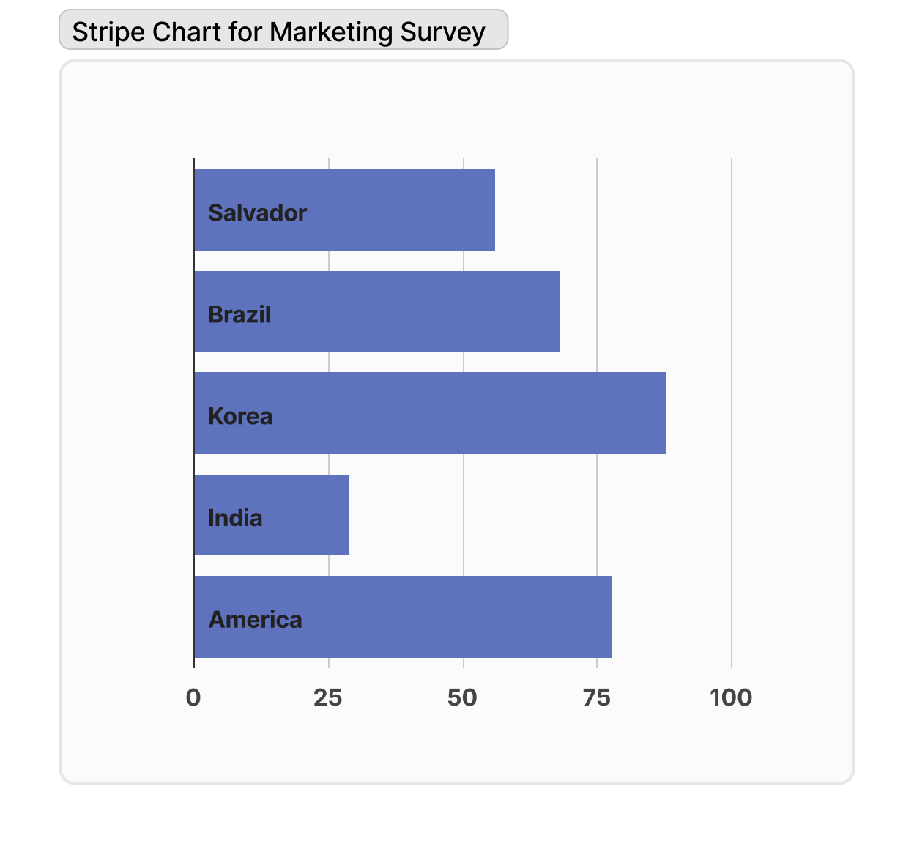
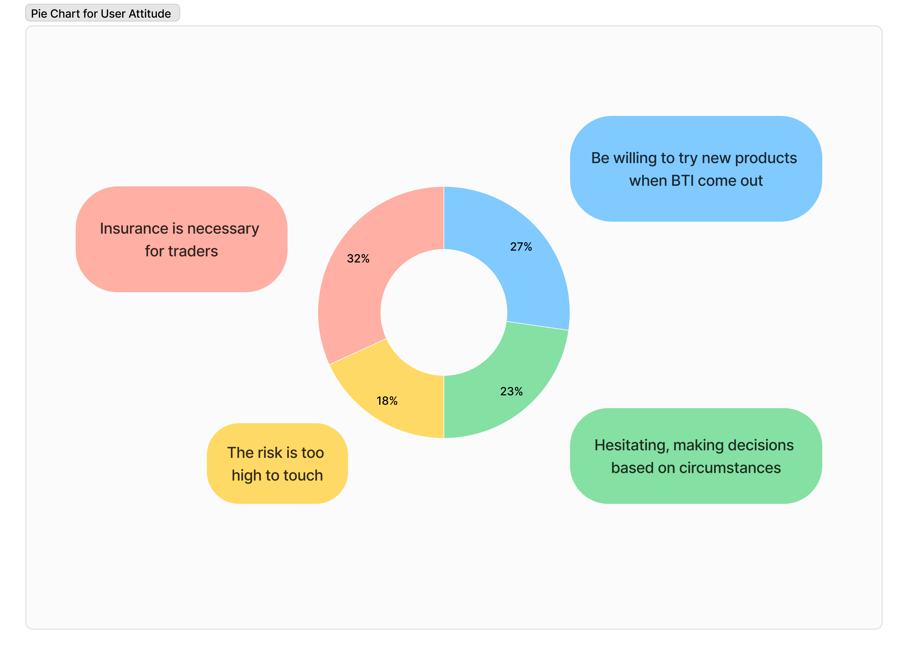

# Market Research

Recently, market research on the BTI project has shown that the majority of users are highly satisfied with the project. Users generally believe that the insurance services provided by the BTI platform effectively reduce their risks in virtual currency trading. Especially for those users involved in high-risk transactions such as high-leverage perpetual contracts, the insurance services provided by the BTI platform serve as an important safety net.

This survey covered multiple countries and a wide range of user groups, including individual investors and institutional users. By surveying users with different backgrounds and experiences, we have gained a comprehensive understanding of the BTI project.
