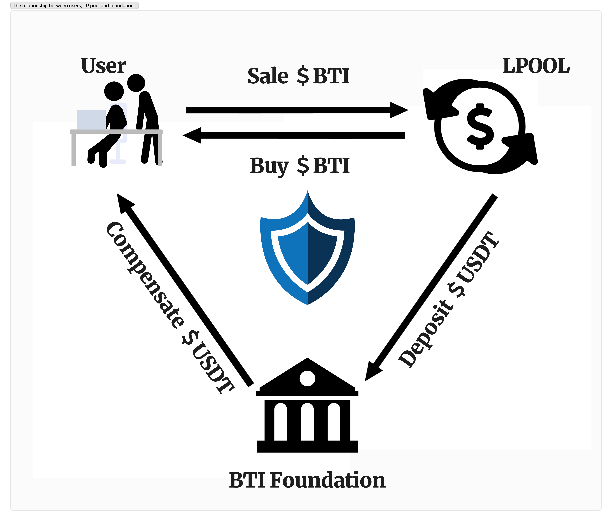

# Finance Model

As a unique virtual currency, the BTI token has both market investment and utility value.

Users can use the $BTI tokens in their accounts to purchase insurance for their contract orders on the BTI platform. The $BTI tokens used for purchasing insurance are sold into the Liquidity Provider (LP) pool in exchange for USDT. The exchanged USDT flows into the platform's insurance fund, providing financial support for future claims. The management of the insurance fund is to ensure that the platform can meet the compensation demand when users' contract orders meet the specified compensation criteria.

When a user's contract order meets the specific compensation criteria, the user can receive compensation from the insurance fund. The compensation amount is paid in USDT, ensuring that users receive corresponding economic compensation when their contract orders incur losses.

As the platform's reputation increases and the demand for $BTI tokens from users grows, users may tend to accumulate low-priced $BTI tokens in advance for future use. With the growth of the BTI platform and the expansion of its user base, the demand for $BTI tokens increases, further driving up their investment value and market price. The increase in market price and investment value can attract more users to join the platform, creating a positive feedback loop.
