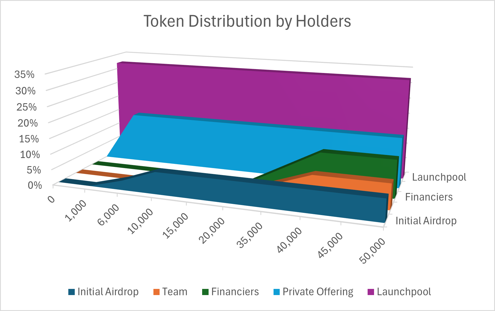

# Token Distribution

The project plans to mint a total of **100000000000000** $BTI tokens.

Token Distribution:

1. **Fair Whitelist Mechanism**: We strongly believe that a fair launch is the standout advantage of our project. Our pre-sales are different from other projects. If anyone sells after the opening, everyone else will suffer losses.
2. **Number of Holders Control Cycle**: Our project progression is not bound by fixed periods; instead, we advance based on actual project milestones. This approach allows for more controlled token release, better protecting our investors' interests.
3. **Long-term Project Commitment:** Our team is dedicated to building a sustainable, long-term project. To demonstrate our commitment, we have voluntarily extended the token vesting period for the team and key users, ensuring steady development and the healthy operation of the ecosystem. Team and equity user tokens will have a 20000-holders cliff, followed by a linear vesting of over 40000 holders.
4. **Community Long-term Support:** The long-term success of the project relies on active engagement and support from the community. Therefore, we have decided to introduce public oversight and voting mechanisms for token utilization, with community governance at its core. This not only contributes to the project's positive development but also helps reduce token emissions, providing a solid foundation for the project's long-term value proposition.

## Vesting Period:

1. **Launchpool**: 47% of tokens will be added to the liquidity pool for trading after launch.
2. **BTI Foundation**: The $BTI tokens in the foundation do not belong to anyone and are used to maintain the ecosystem built around the $BTI token.
3. **Investors**: To ensure the stable development and healthy operation of the ecosystem, team, and equity user tokens will be locked for 3 years.
4. **Initial Airdrop and Sign-in**: This will be distributed during the seed round auction.

⚠️ **Important Note**: Web2 logins will not receive airdrops or win rewards from activities.
